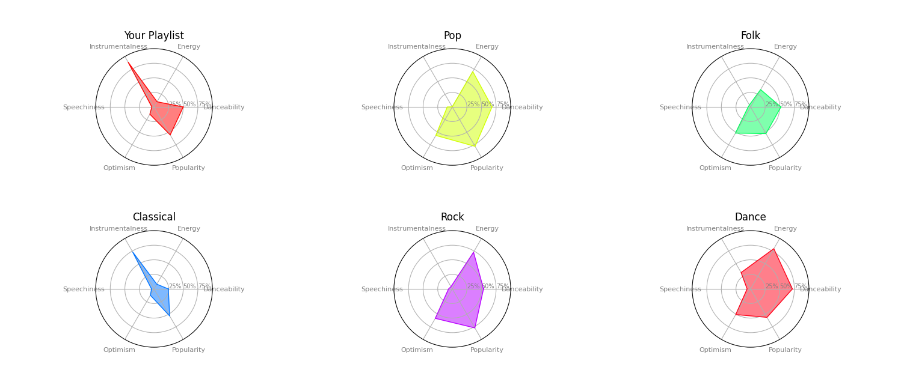
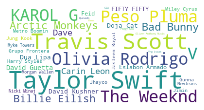
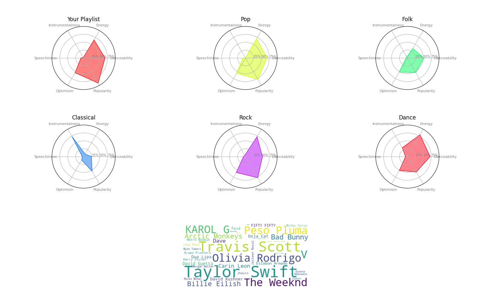

# Summer of Code 2023 - Playlist Analyser 🎼

Hi! Welcome to my entry for Dresscode's Summer of Code 2023!! 

## Introduction 

Here, I have made a program using **Python** that helps you analyse any public playlist, be it your own or someone else's, and compare it to your friends and other genres! These include things like:

- The most recurring artist
- How optimistic, danceable, instrumental, popular, speechy and energetic the songs in your playlist are as a whole
- Compare the above characteristics with typical values from different genres

I did this by gathering data from Spotify's API, using **Spotipy**, which helped me collate audio features like each song's **valence** (how optimistic it sounds), **danceability, instrumentallity, popularity, speechiness** and **energeticness**. Using these I have tried to create interesting and intuiative **radar graphs**, as well as other - more creative - formats such as **word clouds**, to highlight which artists have frequented your playlist the most. I really enjoyed working with this teasure trove of data, and experimenting different ways to most effectively present it. 

## How to Use

To use the code, all you need to do is call it from the command line as such -

```bash
python Playlist_Analyser.py
```
This will ask you for a Playlist URL to analyse.

You can also pass the playlist as a parameter, if you type it in like this - 

```bash
python Playlist_Analyser.py <playlist-url>
```
> For example:  
**python Playlist_Analyser.py https://open.spotify.com/playlist/37i9dQZEVXbNG2KDcFcKOF?si=1333723a6eff4b7f%5CnTo**

## Why did I make this?

So, you might be wondering what inspired me to make this...

Well, first of all I LOVE all things music! It helps me focus, enjoy and connect with other people, as well as relive my favourite Films and TV Series. I am so intrigued by the effect music has on different people, and how each person has their own unique taste.

This is why I wanted to create a program that helped me see how my music taste compared to my friends, or if there was a pattern all the songs in my 'Study' playlist shared, and how that changed according to different playlist, like my 'Dance Mix' or 'Beats to Relax To'. 

I'm incredible proud of this project, as it is the first time I'm using many of these technologies, and putting them all together to create functional code is a huge accomplishment for me. I also really thankful to DressCode for giving me an opprtunity to challenge myself, for giving me the push I needed to step outside my comfort zone and to innovate and explore.

## Examples of Analysis generated by my code
 A Radar Graph Comparing the User's Playlist with Playlists from Other Genres, like Pop, Folk, Classical and Rock

 

 A Word Cloud showing the Most Frequent Artists bigger than the Less Frequent



A Complete Analysis of a playlist, including Display of Audio Features, Comparision of Audio Features to Different Genres and Frequency of Artists in the Playlist 


